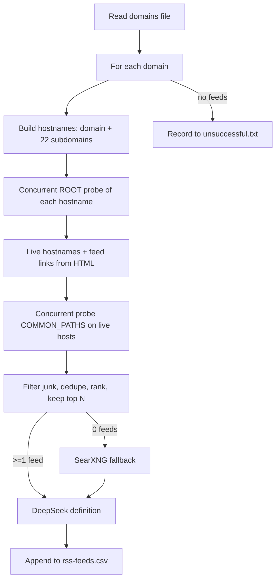

# RSS Feed Discovery Agent

A fast, concurrent Python agent that discovers RSS/Atom feeds for a list of company domains and records them to a CSV, using a local [SearXNG](https://docs.searxng.org/) instance for search fallback and the [DeepSeek](https://platform.deepseek.com/) API to generate human-readable metadata (name, description, category) for each feed.

It runs in two modes:

1. **Domain discovery** — given a file of domains, find every reachable feed on each domain (including common subdomains), validate it, and record the best ones.
2. **Raw URL ingest** — given a curated file of feed URLs, validate each one is up and is a real RSS/Atom feed, then append it without duplicates.

## Features

- **Concurrent probing** — a pool of HTTP workers probes candidate URLs in parallel (connection-pooled `requests.Session`).
- **Sniff-first downloads** — reads only the first 2 KB to decide "is this a feed?" and finishes the download only when it looks like a feed or an HTML page.
- **Subdomain-aware discovery** — checks the bare domain plus 22 common subdomains (`blog`, `newsroom`, `investors`, `research`, `security`, `developer`, etc.).
- **Search fallback** — only queries SearXNG when direct probing finds nothing (last resort).
- **Content-based dedupe** — an MD5 hash of each feed's bytes prevents recording the same feed multiple times via alias URLs (e.g. `/feed` vs `/rss.xml` vs `www.`).
- **Junk filtering & ranking** — skips "comments" feeds and placeholders, collapses the same feed served in RSS+Atom+`/feed` formats, and ranks candidates so the best distinct feeds win the quota.
- **DeepSeek metadata** — generates a name, description, and category per feed (falls back to the feed's own title if the API is unavailable).
- **Resumable** — already-processed domains and feeds are skipped on re-runs.
- **Unsuccessful tracking** — domains with no feeds are recorded to a separate file, deduplicated, and skipped on later runs.

## How it works



## Requirements

- Python 3.10+
- A running SearXNG instance (default `http://karagoz:8080/search`)
- A DeepSeek API key (for metadata generation)
- Network access to the target domains

Dependencies (see [requirements.txt](requirements.txt)):

- `requests` — HTTP client
- `feedparser` — RSS/Atom parsing

## Installation

```bash
cd rss-feeds

# Create a virtual environment and install dependencies
python3 -m venv .venv
.venv/bin/pip install -r requirements.txt
```

### Configure the environment

Copy the example env file and fill in your key:

```bash
cp .env.example .env
```

The only required value is `DEEPSEEK_API_KEY`. Everything else has sensible defaults (see [Configuration](#configuration)).

## Usage

### Mode 1 — Domain discovery

```bash
.venv/bin/python rss_agent.py [domains-file] [options]
```

Defaults to `company-domains.txt` (one domain per line):

```bash
.venv/bin/python rss_agent.py
# or specify a file
.venv/bin/python rss_agent.py my-domains.txt
```

### Mode 2 — Raw URL ingest

Validate a curated list of feed URLs (one per line) and append the valid, non-duplicate ones to the CSV:

```bash
.venv/bin/python rss_agent.py --urls rss-raw.txt
```

### CLI reference

| Argument | Description | Default |
|---|---|---|
| `domains` | Path to the domains text file (one per line). | `company-domains.txt` |
| `--urls` | Path to a raw RSS URL file; validates and appends instead of domain discovery. | — |
| `--output` | Output CSV path. | `rss-feeds.csv` |
| `--unsuccessful` | File for domains with no feeds found. | `unsuccessful.txt` |
| `--limit N` | Process at most N domains (useful for testing). | all |
| `--retry-unsuccessful` | Re-probe domains previously recorded with zero feeds; successes are pruned from the unsuccessful file. | off |
| `--verbose` | Print per-request errors during probing. | off |

### Examples

```bash
# Discover feeds for a custom domain list
.venv/bin/python rss_agent.py my-domains.txt

# Test-run only the first 5 domains
.venv/bin/python rss_agent.py --limit 5

# Re-probe domains that previously had no feeds
.venv/bin/python rss_agent.py --retry-unsuccessful

# Ingest a curated list of feed URLs
.venv/bin/python rss_agent.py --urls rss-raw.txt --output rss-feeds.csv

# Debug a single domain with verbose request logging
.venv/bin/python rss_agent.py --verbose --limit 1
```

## Configuration (`.env`)

All values are optional except `DEEPSEEK_API_KEY`.

| Variable | Description | Default |
|---|---|---|
| `DEEPSEEK_API_KEY` | DeepSeek API key for metadata generation. | — |
| `DEEPSEEK_MODEL` | Model to use. | `deepseek-chat` |
| `CONNECT_TIMEOUT` | Seconds to establish a connection. | `5` |
| `REQUEST_TIMEOUT` | Seconds to wait for a response. | `10` |
| `DEEPSEEK_TIMEOUT` | Seconds to wait for a DeepSeek response. | `60` |
| `POLITE_DELAY` | Seconds between network calls. | `0.75` |
| `MAX_WORKERS` | Parallel HTTP probes. | `12` |
| `FEEDS_PER_DOMAIN` | Distinct feeds to capture per domain. | `3` |
| `SEARXNG_URL` | SearXNG instance URL. | `http://karagoz:8080/search` |

## Output files

### `rss-feeds.csv`

One row per confirmed feed, with these columns:

| Column | Description |
|---|---|
| `domain` | The domain (or subdomain host) the feed belongs to. |
| `feed_url` | The feed URL (post-redirect final URL). |
| `title` | The feed's own `<title>`. |
| `name` | Short name generated by DeepSeek. |
| `description` | One-two sentence description generated by DeepSeek. |
| `category` | Category generated by DeepSeek. |
| `is_up` | Whether the feed returned HTTP 200. |
| `is_rss` | Whether the response parsed as RSS/Atom. |
| `checked_at` | ISO-8601 timestamp of the check. |
| `content_hash` | MD5 of the feed bytes (used for dedupe). |

### `unsuccessful.txt`

One domain per line, for domains where no feed was found. Entries are deduplicated and skipped on later runs (unless `--retry-unsuccessful` is passed).

## Architecture

The pipeline is split into clear stages in [rss_agent.py](rss_agent.py):

- **`probe_url`** — streams a URL, sniffs the first chunk, and only downloads the full body if it is a feed or HTML.
- **`parse_feed`** — validates via `feedparser` and computes the content hash.
- **`discover_feeds`** — Phase A root-probes all hostnames concurrently; Phase B probes common feed paths on live hosts; falls back to SearXNG only if nothing was found.
- **`_select_best_feeds`** — filters junk, dedupes by hash and title, ranks by quality, and keeps the top `FEEDS_PER_DOMAIN`.
- **`process_domain`** / **`process_urls`** — attach DeepSeek metadata and append rows to the CSV.
- **`build_session`** — a shared connection-pooled session with automatic retries on transient errors (429/5xx).

## Notes & limitations

- "Up and valid" means HTTP 200 and the body parses as RSS/Atom; authenticated feeds are not supported.
- Discovery is intentionally capped at `FEEDS_PER_DOMAIN` distinct feeds to balance speed and coverage.
- Re-running is idempotent: already-processed domains and duplicate feeds are skipped.
- Content hashes are computed on the raw bytes, so a feed whose content changes between runs (new posts) gets a new hash — dedupe here targets duplicate *content* (alias URLs), not stale re-processing.

## Troubleshooting

- **`Missing dependency 'feedparser'`** — run `.venv/bin/pip install -r requirements.txt`.
- **"DEEPSEEK_API_KEY environment variable is not set"** — copy `.env.example` to `.env` and set the key. Without it, the agent still runs but uses the feed's own title as the name and leaves description/category blank.
- **SearXNG errors** — verify the instance is reachable and update `SEARXNG_URL` in `.env` if it lives elsewhere.
- **Slow runs** — increase `MAX_WORKERS` and/or decrease `CONNECT_TIMEOUT`/`REQUEST_TIMEOUT` in `.env`.
